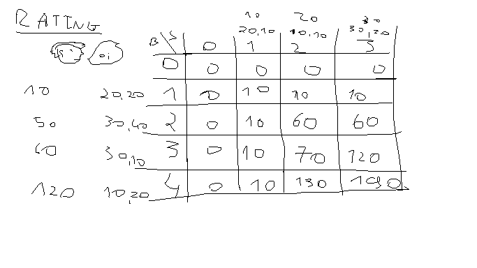

# 1º Trabalho - Cod Fishing

- Dynammic programming where three "matrix" where made, one for each output returns we should have - **Total amount of fish captured**, **Total distance travelled** and **Sum of the rating of the boats**

- Table used for total distance travelled

